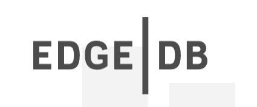
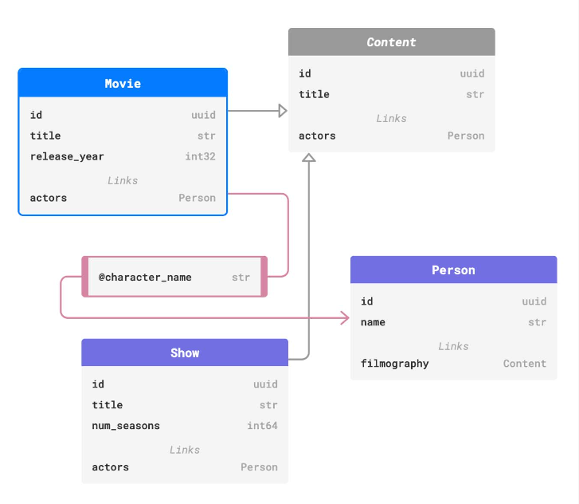
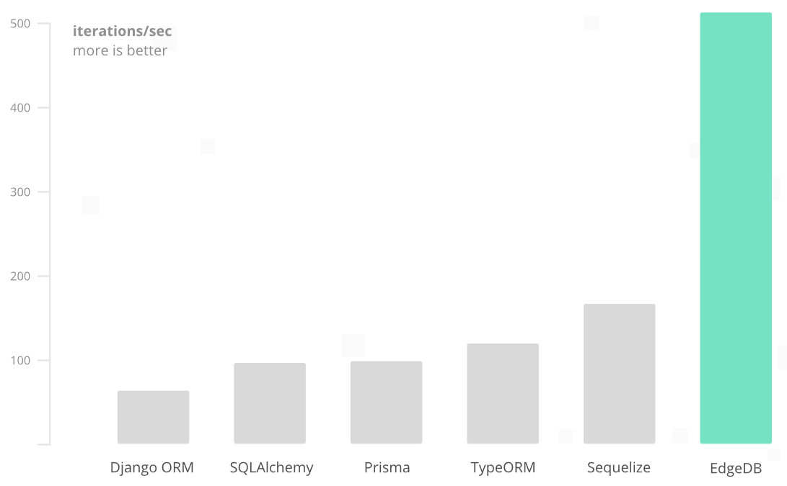

**Доповідь підготував:** 

*студент 2-го курсу, групи ІМ-21*<span padding-right:5em></span> **Владислав ТОКАР** [Пошта: vladyulik@ukr.net, [Телеграм](https://t.me/vladjubra)]



# EdgeDB як приклад бази даних нового покоління

Майже всі сучасні інформаційні продукти так чи інакше використовують бази даних. MySQL, PostgreSQL, MongoDB — кожен розробник чув про ці класичні варіанти. Але все довкола стрімко розвивається, в тому числі і бази даних. Саме тому ця доповідь про EdgeDB, яку можна сміливо вважати інноваційною у цій сфері.

## Історія EdgeDB

EdgeDB виникла як open-source об'єктно-реляційна база даних. Перша її версія була опублікована доволі недавно, а саме у квітні 2018 року. З того часу була додана величезна кількість фіч, найкращими з яких вважають повноцінний графічний інтерфейс та хмарну технологію EdgeDB Cloud. Наразі для цієї бази даних вже доступна версія 4.0, функціонал якої явно не уступає популярним конкурентам.

## Головна відмінність від інших баз даних

Основним недоліком класичних сьогодні варіантів є те, що вони не вирішують проблему неспівпадіння між об'єктно-орієнтованими мовами програмування та реляційними базами даних. Це явище ще називають "об'єктно-реляційною неузгодженістю". Але тут з’являється EdgeDB, яка впроваджує об'єктно-графову модель: дані описуються та зберігаються як сильно типізовані об'єкти та зв'язки між ними, що значно спрощує життя розробникам, яким легше сприймати дані у вигляді об’єктів, а не таблиць.

<table>
<tr>
<td>  </td>
<td>

```ts
module default {

  type Person {
    required name: str;
    link filmography := .<actors[is Content];
  }

  abstract type Content {
    required title: str;
    multi actors: Person {
      character_name: str;
    };
  }

  type Movie extending Content {
    release_year: int32;
  }

  type Show extending Content {
    property num_seasons := count(.<show[is Season]);
  }

};
```

</td>
</tr>
<tr>
<td> <p align="center"> EdgeDB схема </p> </td> 
<td> <p align="center"> Код </p> </td>
</tr>
</table>

## Що потрібно знати про EdgeDB

### Ця база даних:

- Має власну мову запитів EdgeQL, яка за функціоналом не поступається SQL, але при цьому є більш простою для розуміння та усуває JOIN 🤯

<table>
<tr>
<td> 

```sql
select Movie {
  title,
  actors: {
   name
  },
  rating := math::mean(.reviews.score)
} filter "Vladjubra" in .actors.name;


```

</td>
<td>

```sql
SELECT
  title,
  Actors.name AS actor_name,
  (SELECT avg(score)
    FROM Movie_Reviews
    WHERE movie_id = Movie.id) AS rating
FROM
  Movie
  LEFT JOIN Movie_Actors ON
    Movie.id = Movie_Actors.movie_id
  LEFT JOIN Person AS Actors ON
    Movie_Actors.person_id = Person.id
WHERE
  'Vladjubra' IN (
    SELECT Person.name
    FROM
      Movie_Actors
      INNER JOIN Person
        ON Movie_Actors.person_id = Person.id
    WHERE
      Movie_Actors.movie_id = Movie.id)
```

</td>
</tr>
<tr>
<td> <p align="center"> EdgeQL </p> </td> 
<td> <p align="center"> SQL </p> </td>
</tr>
</table>

- Підтримує TypeScript & JavaScript, Python, Go, .NET, Dart, Deno, Rust, Java та Elixir

- Усуває потребу в додаткових інструментах, таких як ORM

- Має універсальний CLI, який дозволяє створювати нові бази даних, застосовувати схеми міграцій, запускати вбудований графічний інтерфейс та виконувати безліч інших дій

- Включає в себе EdgeDB Cloud — повністю керований та легкий у використанні хмарний сервіс, який дозволяє миттєво розгортати бази даних та підключатися до них з будь-якого місця

- Включає в себе велику та різноманітну бібліотеку стандартних типів, функцій та операторів

- Має повністю відкритий код, який включає в себе ядро бази даних, клієнтські бібліотеки, інтерфейс командного рядка та багато інших сервісів

- Є надзвичайно швидкою та оптимізованою 

<table>
<tr> <td>  </td> </tr>
<tr> <td> <p align="center"> Порівняння EdgeDB з іншими популярними варіантами </p> </td> </tr>
</table>

- Володіє унікальною здатністю до автоматичної міграції бази даних, що полегшує процес розвитку проєктів та зберігає стабільність в роботі

- Має розширену підтримку JSON, яка дозволяє легко працювати з JSON-структурами в запитах

- Має явну обробку дат та часу, яка не супроводжується неоднозначністю

- Розроблена таким чином, щоб легко справлятися з великими обсягами даних та високими навантаженнями, що робить її ідеальним вибором для проєктів, які розвиваються та розширюються з часом.

- Має вбудовану систему безпеки, яка включає механізми контролю доступу та аутентифікації, що забезпечуть високий рівень захисту даних

- Базується на PostgreSQL 

- Підтримує GraphQL

## Висновок

EdgeDB — це не просто ще одна база даних. Це інноваційна технологія вирішення проблеми об'єктно-реляційного неузгодження, яка, окрім цього, пропонує високорівневий інтерфейс для роботи з даними, забезпечує зручність і продуктивність, має інтеграційну платформу, асинхронне ядро, продуману графо-реляційну модель та інші інновації. Все це робить її неймовірно потужним і перспективним інструментом для розробників.

# Інструкція для початку роботи

### 1. Встановити локально EdgeDB

Windows: `iwr https://ps1.edgedb.com -useb | iex`

Linux and macOS: `curl --proto '=https' --tlsv1.2 -sSf https://sh.edgedb.com | sh`

### 2. Створити новий проєкт

`edgedb project init`

### 3. Відкрити початкову EdgeDB схему та відредагувати її на свій розсуд

### 4. Зробити міграцію

`edgedb migration create`

`edgedb migration apply`

### 5. Відкрити EdgeDB UI для подальшої взаємодії із проєктом

`edgedb ui`